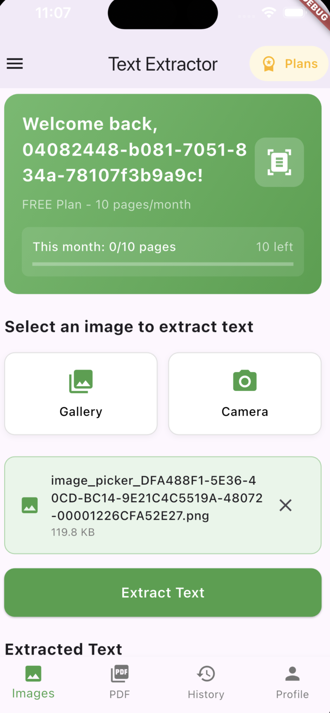
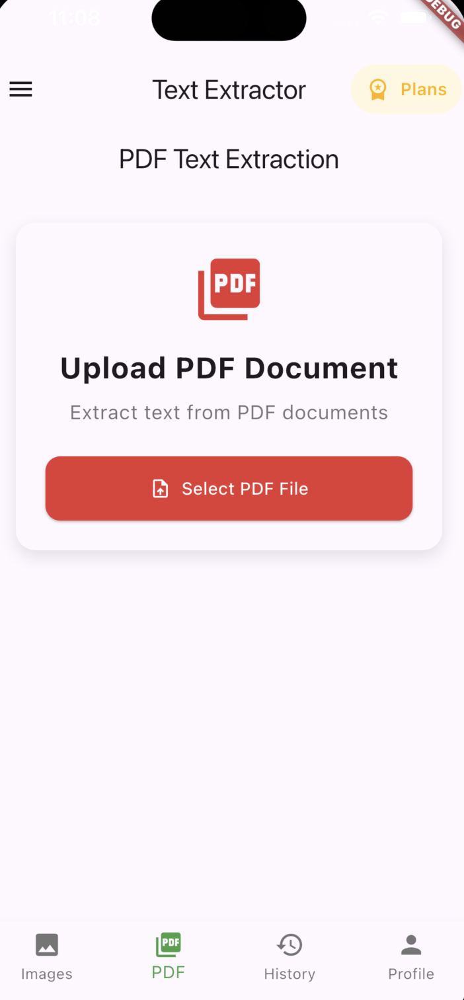

# ZAR Textract UI

Flutter UI components for document text extraction applications. This is a **UI-only repository** providing reusable interface components without backend implementation.

## Screenshots

  

## What's Included

- 📱 Complete UI screens (auth, document upload, text display)
- 🎨 Reusable widgets (image picker, PDF viewer, text display)
- 🔧 Abstract service interfaces (no implementation)
- 📋 Data models for UI state management

## Quick Start

1. **Install dependencies:**
```bash
flutter pub get
```

2. **Generate platform files** (if needed):
```bash
flutter create --platforms=android,ios,web,macos,linux,windows .
```

3. **Implement the service interfaces** in `lib/services/` with your backend:
   - `AuthService` - Handle user authentication
   - `TextractService` - Document text extraction
   - `UserService` - User profile and subscription management

4. **Configure your backend** (replace placeholders in `amplifyconfiguration.dart`)

5. **Run:**
```bash
flutter run
```

## Architecture

```
lib/
├── screens/     # Complete UI screens
├── widgets/     # Reusable UI components
├── services/    # Abstract interfaces (implement these!)
├── models/      # Data models
└── main.dart    # App entry point
```

## Usage

This UI can work with any backend that implements the service interfaces. Popular choices:
- AWS (Amplify, Cognito, Textract)
- Firebase (Auth, Functions, ML Kit)
- Custom REST APIs
- Other cloud providers

## License

MIT License - Use freely in your projects.
